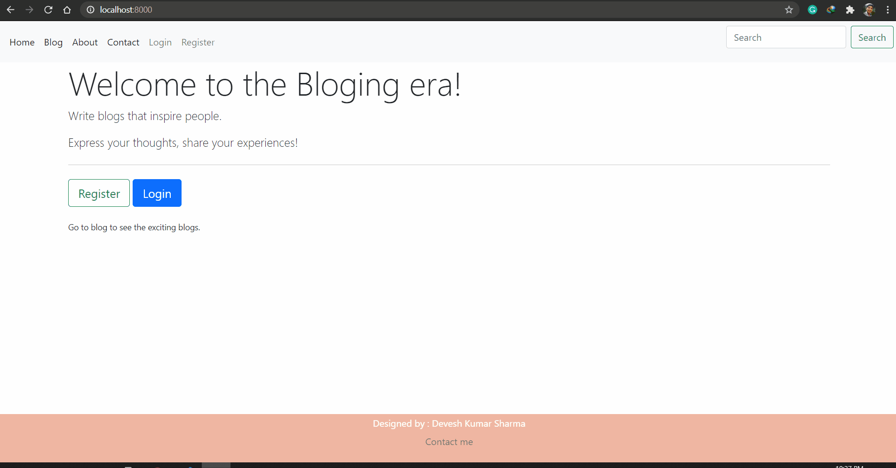

# BlogProject

* In this project we have included the facility of multi-author blogs, which will allow
the bloggers to interact even with the more people of the same interest.
* There is a separate admin interface for the superuser of the website to directly do
the all the change that can be done by the blogger plus some additional
functionality.
* Contact form and about section link has also be provided in the navbar for
communication purpose and other details.

### TECHNOLOGY USED :
* FRONT END : HTML , CSS, Bootstrap.
* BACK END : DJANGO FRAMEWORK
* DATABASE USED : SQL LITE

### SYSTEM MODULE :
The modules involved in this project are :
1. User
2. Admin
